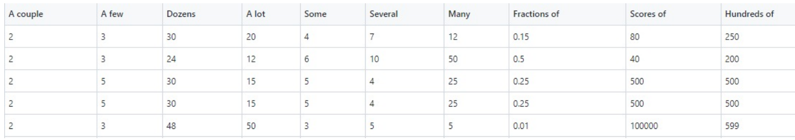
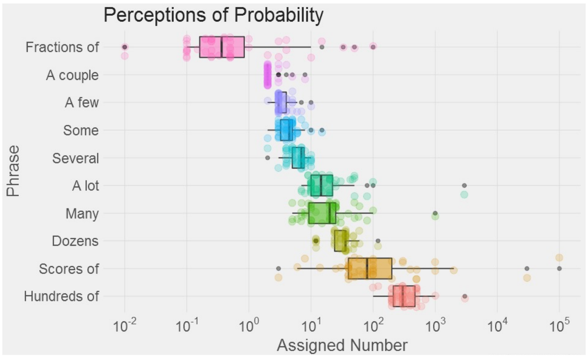
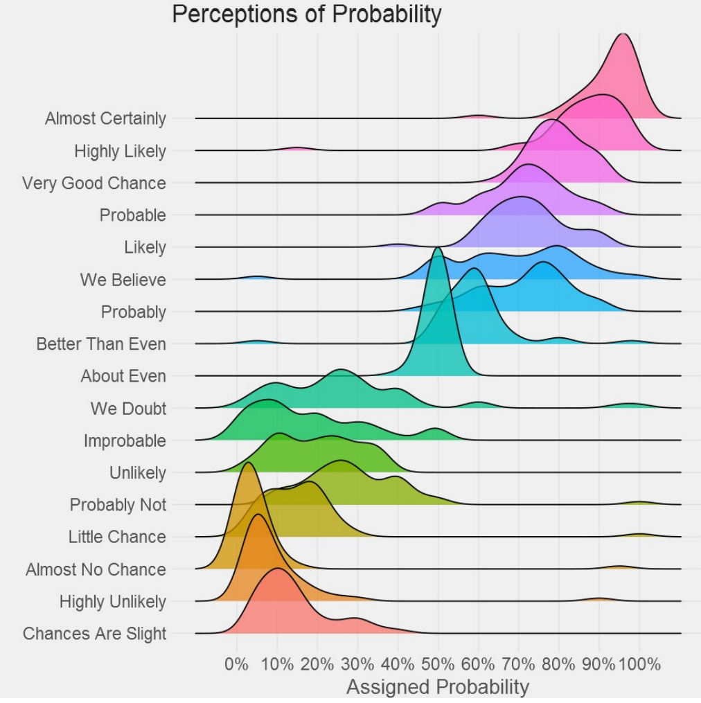

# # hw1 Perceptions of Probability and Numbers

### Task description:

What probability/number would you assign to the phrase? 

Visualize the frequency of phrase usage with the d3.js library

### Data formats:

 .csv

### Visualizations:

### Useful examples

https://www.d3-graph-gallery.com/boxplot.html

https://observablehq.com/@d3/gallery

